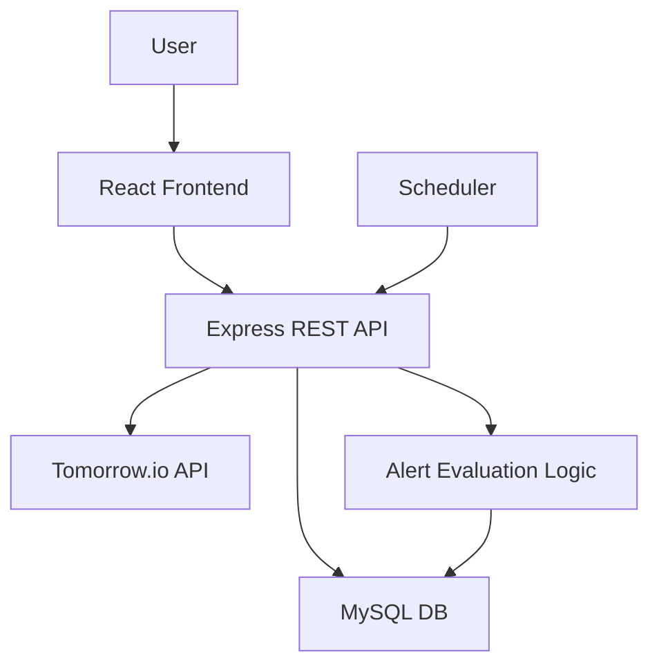

# 🌤️ Weather Alert System - MVP

## 🚀 Quick Start

### Prerequisites
- Node.js (version 16 or higher)
- npm or yarn
- MySQL (version 8.0 or higher)

#### Installing MySQL on macOS
```bash
# Install MySQL using Homebrew
brew install mysql

# Start MySQL service
brew services start mysql

# Verify MySQL is running
brew services list | grep mysql
```

### Installation & Setup
```bash
# Install dependencies
npm install

# Copy environment file and configure database
cp env.example .env
# Edit .env with your MySQL credentials

# Create MySQL database
mysql -u root -p -e "CREATE DATABASE IF NOT EXISTS weather_alerts;"

# Start the server
npm start

# Or for development
npm run dev
```

### Available Endpoints
- `GET /` - Hello World endpoint
- `GET /health` - Health check endpoint (includes database status)
- `POST /api/alerts` - Create new weather alert
- `GET /api/alerts` - List all alerts with their current status

### Testing the API
```bash
# Test Hello World endpoint
curl http://localhost:3000

# Test health check (includes database status)
curl http://localhost:3000/health

# Create a new weather alert
curl -X POST http://localhost:3000/api/alerts \
  -H "Content-Type: application/json" \
  -d '{
    "lat": 40.7128,
    "lon": -74.0060,
    "parameter": "temperature",
    "operator": ">",
    "threshold": 30,
    "description": "High temperature alert for NYC"
  }'

# List all alerts
curl http://localhost:3000/api/alerts
```

---

## 🧠 High-Level Design (HLD)

### ⚙️ Architecture Overview

```
[User] → [React App] → [NodeJS API Server] → [MySQL]
                                     ↓
                          [Tomorrow.io Weather API]
                           ↑
                 [Scheduled Alert Evaluator]
```

### 🧩 Components

| Component              | Description |
|------------------------|-------------|
| **React Frontend**     | Basic 3-tab interface (Home, Alerts, Current State) |
| **NodeJS REST API**    | CRUD endpoints for alerts, weather fetching |
| **MySQL DB**           | Store user alerts and their trigger state |
| **Tomorrow.io API**    | External API for weather data |
| **Scheduler (Node Cron)** | Runs every 5 mins to evaluate alert triggers |

---

### 🌐 API Endpoints

| Method | Endpoint             | Purpose |
|--------|----------------------|---------|
| `POST`| `/api/alerts`         | Create new alert |
| `GET` | `/api/alerts`         | List all alerts |
| `GET` | `/api/alerts/status`  | Get current alert states |
| `GET` | `/api/weather`        | Fetch weather for a location |

---

### 📦 DB Schema (MySQL)

#### `alerts`
| id | lat | lon | parameter | operator | threshold | description | created_at |
|----|-----|-----|-----------|----------|-----------|-------------|------------|

#### `alert_status`
| id | alert_id | is_triggered (boolean) | checked_at |

---

### 📊 Mermaid.js Flowchart



---

## 🚀 MVP Execution Plan (~3 hrs total)

> Follow 80/20 rule: prioritize core weather alerts + status UI

| Step | Task | Description | Time Estimate |
|------|------|-------------|----------------|
| 1    | Setup NodeJS + Express + MySQL | Create basic Express app, connect to MySQL | 15 min |
| 2    | REST API: `POST /api/alerts` | Save alerts (location, param, threshold) | 20 min |
| 3    | REST API: `GET /api/alerts` | Retrieve list of alerts | 10 min |
| 4    | REST API: `GET /api/alerts/status` | Show current triggered alerts | 10 min |
| 5    | Integrate Tomorrow.io API | Use `fetch`/`axios` to get real-time weather | 15 min |
| 6    | Cron Job / Scheduler | Evaluate alerts every 5 mins using `node-cron` | 30 min |
| 7    | Setup React with 3 Tabs | Home, Alerts, Current State – minimal styling | 30 min |
| 8    | Alert creation form (React) | Call API to submit alert | 15 min |
| 9    | Display active alert states | Pull from `/api/alerts/status` | 10 min |
|      | **Total MVP Time**         | 3 hours approx. | **~180 min** |

---

## ✅ Definition of Done

- [x] Weather data fetched from Tomorrow.io for at least one location
- [x] Alerts can be created via REST API
- [x] Weather alert evaluation scheduled (cron)
- [x] Trigger status of alerts is calculated and stored
- [x] Minimal React UI with 3 working sections
- [x] Run locally via Docker or manual setup

---

## 🧪 Bonus Tasks (Time-permitting)

| Task | Description | Est. Time |
|------|-------------|-----------|
| TypeScript support | Use TS for backend and/or frontend | +30–45 min |
| Email/SMS alerts | Use service like Twilio/sendgrid | +60 min |
| User authentication | Add user login, tie alerts to user | +45–60 min |
| Persistent weather caching | Avoid redundant API calls | +20 min |
| Deploy to Vercel/Render/Fly.io | Host backend + frontend | +30 min |
| Docker Compose full stack | DB, API, client in one container | +30 min |
| Mobile app | React Native / Expo or Kotlin | +1–2 hrs |
